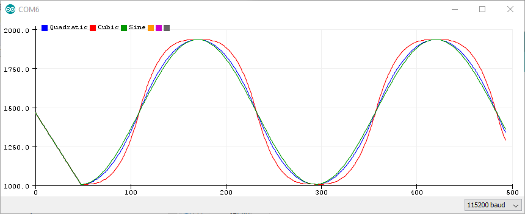
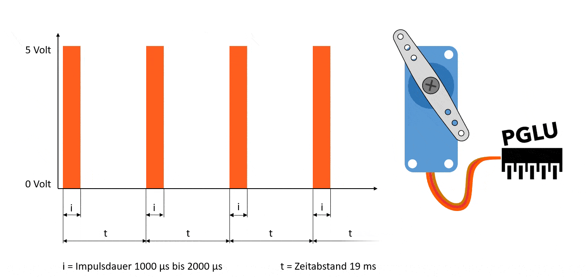

<div align = center>

# [ServoEasing](https://github.com/ArminJo/ServoEasing)
A library for smooth servo movements.<br/>
It uses the standard Arduino Servo library and therefore has its restrictions regarding pins and platform support.

[](https://www.gnu.org/licenses/gpl-3.0)
 &nbsp; &nbsp;
[](https://github.com/ArminJo/ServoEasing/releases/latest)
 &nbsp; &nbsp;
[](https://github.com/ArminJo/ServoEasing/commits/master)
 &nbsp; &nbsp;
[](https://github.com/ArminJo/ServoEasing/actions)
 &nbsp; &nbsp;

<br/>
<br/>
[](https://stand-with-ukraine.pp.ua)

Available as [Arduino library "ServoEasing"](https://www.arduinolibraries.info/libraries/servo-easing).
Contains the [QuadrupedControl](https://github.com/ArminJo/QuadrupedControl) example.

[](https://www.ardu-badge.com/ServoEasing)
 &nbsp; &nbsp;
[](https://arminjo.github.io/ServoEasing/classServoEasing.html)
 &nbsp; &nbsp;
[](https://github.com/ArminJo/ServoEasing?tab=readme-ov-file#revision-history)

</div>

#### If you find this library useful, please give it a star.

&#x1F30E; [Google Translate](https://translate.google.com/translate?sl=en&u=https://github.com/ArminJo/ServoEasing)

<br/>

#### YouTube video of ServoEasing in action

[](https://www.youtube.com/watch?v=fC9uxdOBhfA)

# Table of content
- [Servo easing library for Arduino](https://github.com/ArminJo/ServoEasing?tab=readme-ov-file#servo-easing-library-for-arduino)
- [Features](https://github.com/ArminJo/ServoEasing?tab=readme-ov-file#features)
- [List of easing functions](https://github.com/ArminJo/ServoEasing?tab=readme-ov-file#list-of-easing-functions)
- [API](https://github.com/ArminJo/ServoEasing?tab=readme-ov-file#api)
- [Usage](https://github.com/ArminJo/ServoEasing?tab=readme-ov-file#usage)
- [Multiple servo handling](https://github.com/ArminJo/ServoEasing?tab=readme-ov-file#multiple-servo-handling)
- [Comparison between Quadratic, Cubic and Sine easings.](https://github.com/ArminJo/ServoEasing?tab=readme-ov-file#comparison-between-quadratic-cubic-and-sine-easings)
- [Useful resources](https://github.com/ArminJo/ServoEasing?tab=readme-ov-file#useful-resources)
- [Resolution of servo positioning](https://github.com/ArminJo/ServoEasing?tab=readme-ov-file#resolution-of-servo-positioning)
- [Mapping of servo positioning](https://github.com/ArminJo/ServoEasing?tab=readme-ov-file#mapping-of-servo-positioning)
- [Speed of servo positioning](https://github.com/ArminJo/ServoEasing?tab=readme-ov-file#speed-of-servo-positioning)
- [Minimum number of pulses for reliable servo positioning](https://github.com/ArminJo/ServoEasing?tab=readme-ov-file#minimum-number-of-pulses-for-reliable-servo-positioning)
- [Why *.hpp instead of *.cpp](https://github.com/ArminJo/ServoEasing?tab=readme-ov-file#why-hpp-instead-of-cpp)
- [Using the new *.hpp files](https://github.com/ArminJo/ServoEasing?tab=readme-ov-file#using-the-new-hpp-files)
- [Compile options / macros for this library](https://github.com/ArminJo/ServoEasing?tab=readme-ov-file#compile-options--macros-for-this-library)
- [Using PCA9685 16-Channel Servo Expander](https://github.com/ArminJo/ServoEasing?tab=readme-ov-file#using-pca9685-16-channel-servo-expander)
- [Using the included Lightweight Servo library for ATmega328](https://github.com/ArminJo/ServoEasing?tab=readme-ov-file#using-the-included-lightweight-servo-library-for-atmega328)
- [Handling multiple servos with the internal ServoEasingArray](https://github.com/ArminJo/ServoEasing?tab=readme-ov-file#handling-multiple-servos-with-the-internal-servoeasingarray)
- [Examples for this library](https://github.com/ArminJo/ServoEasing/blob/master/examples#servoeasing-examples)
- [WOKWI online examples](https://github.com/ArminJo/ServoEasing?tab=readme-ov-file#wokwi-online-examples)
- [Servo utilities](https://github.com/ArminJo/ServoEasing/tree/master/examples#servo-utilities)
- [Building breadboard servo adapter](https://github.com/ArminJo/ServoEasing?tab=readme-ov-file#building-breadboard-servo-adapter)
- [Internals](https://github.com/ArminJo/ServoEasing?tab=readme-ov-file#internals)
- [Supported Arduino architectures](https://github.com/ArminJo/ServoEasing?tab=readme-ov-file#supported-arduino-architectures)
- [Timer usage for interrupt based movement](https://github.com/ArminJo/ServoEasing?tab=readme-ov-file#timer-usage-for-interrupt-based-movement)
- [Adding a new platform / board](https://github.com/ArminJo/ServoEasing?tab=readme-ov-file#adding-a-new-platform--board)
- [Troubleshooting](https://github.com/ArminJo/ServoEasing?tab=readme-ov-file#troubleshooting)
- [Revision History](https://github.com/ArminJo/ServoEasing?tab=readme-ov-file#revision-history)
- [CI](https://github.com/ArminJo/ServoEasing?tab=readme-ov-file#ci)
- [Requests for modifications / extensions](https://github.com/ArminJo/ServoEasing?tab=readme-ov-file#requests-for-modifications--extensions)

<br/>

# Servo easing library for Arduino
Its purpose is to interpolate the movement between two servo positions set by software.<br/>
If your servo control data is e.g. generated by an joystick or other *"slow"* changing inputs and therefore does not change suddenly or does not jump, **you most likely do not need this library!**, you may consider to use a **digital low pass** or **[simple EMA filters](https://github.com/ArminJo/Arduino-Utils?tab=readme-ov-file#simpleemafilters)** to smooth your values used to control the servos.<br/>
ServoEasing works with the Arduino Servo library as well as with [PCA9685 servo expanders](https://learn.adafruit.com/16-channel-pwm-servo-driver?view=all).
The expander in turn requires the Arduino Wire library or a [compatible one](https://github.com/felias-fogg/SoftI2CMaster) and is bound to their restrictions.<br/>
For **ESP32** you need to install the Arduino ESP32Servo library.<br/>
<br/>
If you require only one or two servos, you may want to use the included [LightweightServo library](https://github.com/ArminJo/LightweightServo) which is like the [Adafruit TiCoServo library](https://github.com/adafruit/Adafruit_TiCoServo), but more lightweight and currently only for **Uno, Nano**, instead of the Arduino Servo library.
The LightweightServo library uses the internal Timer1 with no software overhead and therefore has no problems with **servo twitching** or interrupt blocking libraries like SoftwareSerial, Adafruit_NeoPixel and DmxSimple.<br/>
For instructions how to enable these alternatives, see [Compile options / macros](https://github.com/ArminJo/ServoEasing?tab=readme-ov-file#compile-options--macros-for-this-library).

<br/>

# Features
- **Linear** and 9 other ease movements are provided.
- All servos can move **synchronized** or **independently**.
- **Non blocking** movements are implemented by the **startEaseTo\* functions** by using a timer. This functions are not available for all platforms.
- Degree values >= 400 is taken as microsecond values for the servo pulse to allow fine-grained control.
- **Float angels** are supported to allow **fine-grained servo control** comparable to using microseconds.
- **User-specified callback function at "servo arrived" enables movement control independent of main loop**.
- **Stop and resume** of servo movement.
- A **trim value** can be set for any servo. Its value is internally added to each requested position.
- **Reverse operation** of servo is possible e.g. if it is mounted head down.
- **Constraints for minimum and maximum servo degree** can be specified. Trim and reverse are applied after constraint processing.
- Allow to specify an [**arbitrary mapping between degrees and microseconds**](https://github.com/ArminJo/ServoEasing?tab=readme-ov-file#mapping-of-servo-positioning) by `attach(int aPin, int aMicrosecondsForServoLowDegree, int aMicrosecondsForServoHighDegree, int aServoLowDegree, int aServoHighDegree)`.
- **Servo speed** can be specified in **degree per second** or **milliseconds** for the complete move.
- **Multiple servo handling** by *ForAllServos() functions like `setIntegerDegreeForAllServos(3, 135, 135, 135)`.
- All ServoEasing objects are accessible by using the [`ServoEasing::ServoEasingArray[]`](https://github.com/ArminJo/ServoEasing/blob/master/examples/ThreeServos/ThreeServos.ino#L104).
- Easy implementation of a **move list** - see [ConsecutiveEasingsWithCallback example](https://github.com/ArminJo/ServoEasing/blob/master/examples/ConsecutiveEasingsWithCallback/ConsecutiveEasingsWithCallback.ino#L150).

# List of easing functions
` Linear ` &nbsp; &nbsp; ` Quadratic ` &nbsp; &nbsp; ` Cubic ` &nbsp; &nbsp; ` Quartic `

` Sine ` &nbsp; &nbsp; ` Circular ` &nbsp; &nbsp; ` Back ` &nbsp; &nbsp; ` Elastic ` &nbsp; &nbsp; ` Bounce `

` Precision ` &nbsp; &nbsp; ` Dummy ` &nbsp; &nbsp; ` User defined `

- **Precision** is like linear, but if descending, add a 5 &deg; negative bounce in the last 20 % of the movement time. So the target position is always approached from below. This enables it to taken out the slack/backlash of any hardware moved by the servo.
- **Dummy** is used for delays in callback handler.


### All easing functions can be used in the following variants:
All ease functions are called internally with the value: `PercentageOfCompletion / 100` giving a call value from 0 to 1.

- In: Start the function with 0 and go to 1 linear. Except for PRECISION, where we do a bounce if approaching from above (go in to origin).
- Out: Start the function with 1 and go to 0 linear. Except for PRECISION, where we do a bounce if approaching from  below (go out from origin).
- InOut: Start the function with 0 go to 1 and back to 0.
- Bouncing: Start with OUT, then return with IN to start degree. E.g. Bouncing of the SINE function results in the upper (positive) half of the sine.

#### All easing types (starting in flavor IN_OUT, then IN, OUT and BOUNCE) in one plot.<br/>
Since the values are computed in a fixed 20 ms raster, the last degree increment or decrement
in an easing may be much smaller than the increment/decrement before,
resulting in some small discontinuities between adjacent movements.<br/>


### Constraints
To restrict servo movements to a fixed range, you can specify constraints with `setMinMaxConstraint(int aMinDegreeOrMicrosecond, int aMaxDegreeOrMicrosecond)`.<br/>
#### Arduino Plotter Output with constraints at 5 &deg; and 175 &deg; activated.


### Disable easing temporarily
By setting speed -which is an uint16- to a real high value like e.g. 50000, you can effectively disable easing
and get almost the same behavior as if using Servo.write() function directly.

<br/>

# API
For floating point constants, use the notation of 123.456f with **trailing f** (for a floating point constant) to avoid compiler errors.
A Doxygen documentation of the sources is available [here](https://arminjo.github.io/ServoEasing/classServoEasing.html).

# Usage
See also [the examples here](https://github.com/ArminJo/ServoEasing/blob/master/examples#servoeasing-examples).<br/>

```c++
void setup() {
    Servo1.attach(SERVO1_PIN, 45);
}
void loop() {
    Servo1.setEasingType(EASE_CUBIC_IN_OUT); // EASE_LINEAR is default
    Servo1.easeTo(135, 40);                                 // Blocking call
    Servo1.startEaseTo(45, 40, START_UPDATE_BY_INTERRUPT);  // Non blocking call
    // Now the servo is moving to the end position independently of your program.
    delay(5000);
}
```

Just call `myServo.startEaseTo()` instead of `myServo.write()` and you are done. Or if you want to wait (blocking) until servo has arrived, use `myServo.easeTo()`.<br/>
- Do not forget to **initially set the start position** for the Servo, since the library has **no knowledge about your servos initial position** and therefore starts at **0 &deg;** at the first move, which may be undesirable.<br/>
  Setting the start position of the servo can be done as the second parameter to `myServo.attach(int aPin, int aInitialDegree)` or by calling `myServo.write(int aDegree)`,
- And do not forget to **initially set the moving speed** (as degrees per second) with `myServo.setSpeed()` or as **second parameter** to startEaseTo() or easeTo(). Otherwise the Servo will start with the speed of 5 &deg; per second, to indicate that speed was not set.<br/>

<br/>

# Multiple servo handling
You can handle multiple servos simultaneously by [special functions](https://github.com/ArminJo/ServoEasing/blob/master/src/ServoEasing.h#L674) like
 `writeAllServos()`, `setSpeedForAllServos()`, `setIntegerDegreeForAllServos()`, `setEaseToDForAllServos()`, `updateAndWaitForAllServosToStop()`, `setEaseToForAllServosSynchronizeAndWaitForAllServosToStop()`,  `setEaseToForAllServosSynchronizeAndStartInterrupt()` and much more.<br/>
 [See below](https://github.com/ArminJo/ServoEasing?tab=readme-ov-file#handling-multiple-servos-with-the-internal-servoeasingarray).

<br/>

# Comparison between Quadratic, Cubic and Sine easings.
**Arduino Serial Plotter** result of the SymmetricEasing example.


<br/>

# Useful resources
- [Easings Cheat Sheet](https://easings.net/)
- [Robert Penner](http://www.robertpenner.com/easing/)
- [Easing C functions on Github](https://github.com/warrenm/AHEasing/blob/master/AHEasing/easing.c)
- [Interactive cubic-bezier](http://cubic-bezier.com)
- Servo signal gif from https://workshop.pglu.ch/arduino-servo/
[](https://workshop.pglu.ch/arduino-servo/)

<br/>

# Resolution of servo positioning
- The standard range of 544 to 2400 &micro;s per 180 &deg; results in an timing of around **10 &micro;s per degree**.
- The **Arduino Servo library on AVR** uses an prescaler of 8 at 16 MHz clock resulting in a resolution of **0.5 &micro;s**.
- The **PCA9685 expander** has a resolution of **4.88 &micro;s** per step (@ 20 ms interval) resulting in a resolution of **0.5 &deg;**.
Digital Servos have a **deadband of approximately 5 &micro;s / 0.5 &deg;** which means, that you will see a **stuttering movement** if the moving speed is slow.
If you control them with a PCA9685 expander it may get worse, since one step of 4.88 &micro;s can be within the deadband, so it takes 2 steps to move the servo from its current position.

# Mapping of servo positioning
If you want to **operate your servo e.g. from -90 &deg; to +90 &deg;**, you have two possibilities to specify this during attach:
1. Use `Servo1.attachWithTrim(SERVO1_PIN, 90, START_DEGREE_VALUE, DEFAULT_MICROSECONDS_FOR_0_DEGREE, DEFAULT_MICROSECONDS_FOR_180_DEGREE)` like it is done in the [TwoServos example](https://github.com/ArminJo/ServoEasing/blob/master/examples/TwoServos/TwoServos.ino#L94).
2. Use `Servo1.attach(SERVO1_PIN, DEFAULT_MICROSECONDS_FOR_0_DEGREE, DEFAULT_MICROSECONDS_FOR_180_DEGREE, -90, 90)`.

If your servo has **other timing characteristics than the default** one -544 &micro;s for 0 and 2400 &micro;s for 180 &deg; - you have to use `Servo1.attach(SERVO1_PIN, <MY_SERVO_MICROSECONDS_FOR_0_DEGREE>, <MY_SERVO_MICROSECONDS_FOR_180_DEGREE>)`.<br/>
You can combine this with variant 2 from above to transparently specify your servo characteristics e.g. like it is done in the [RobotArmControl example]( https://github.com/ArminJo/ServoEasing/blob/master/examples/RobotArmControl/RobotArmServoConfiguration.h#L97):

```c++
#define PIVOT_MICROS_AT_PLUS_70_DEGREE        2400 // Left - the MG90 servos are not capable of full 180°
#define PIVOT_MICROS_AT_MINUS_70_DEGREE        700 // Right
BasePivotServo.attach(PIVOT_SERVO_PIN, 0, PIVOT_MICROS_AT_MINUS_70_DEGREE, PIVOT_MICROS_AT_PLUS_70_DEGREE, -70, 70);
```

# Speed of servo positioning
These values are measured with the [SpeedTest example](https://github.com/ArminJo/ServoEasing/blob/master/examples/SpeedTest/SpeedTest.ino).

These are the fastest values for my SG90 servos at 5 volt (4.2 volt with servo active).
| Degree | Duration | Speed |
|-|-|-|
| 180 | 400 ms | 450 degree per second |
| 90 | 300 ms  | 300 degree per second |
| 45 | 180 ms  | 250 degree per second |
| 30 | 150 ms  | 200 degree per second |
| 20 | 130 ms  | 150 degree per second |
| 10 | 80 ms   | 125 degree per second |

Values for the MG90Sservos servos at 5 volt (4.2 volt with servo active).
| Degree | Duration | Speed |
|-|-|-|
| 180 | 330 ms | 540 degree per second |
| 90 | 220 ms  | 410 degree per second |
| 45 | 115 ms  | 390 degree per second |

<br/>

# Minimum number of pulses for reliable servo positioning
After disconnected, my **SG90** servo requires **4 pulses for a 180 degree turn**. It may be less, if the turn is smaller.<br/>
After disconnected, my**MG90** servo requires **1 pulse for a 110 degree turn**. the second pulse (after 20 ms) adds around 10 degree to it, 
so it takes around 6 to 7 pulses (120 ms to 140 ms) for a complete 180 degree turn.<br/>
These values seems to be **independent of the turn direction**.

These values are measured with the [UnitTest example](https://github.com/ArminJo/ServoEasing/blob/f6a2d7b332ff64639cc770d7ee39aa29f6fd444e/examples/UnitTests/UnitTests.ino#L278) with `TEST_FIXED_PULSE_NUMBERS` defined.
<br/>

# Why *.hpp instead of *.cpp?
**Every \*.cpp file is compiled separately** by a call of the compiler exclusively for this cpp file. These calls are managed by the IDE / make system.
In the Arduino IDE the calls are executed when you click on *Verify* or *Upload*.<br/>
And now our problem with Arduino is: **How to set [compile options](#compile-options--macros-for-this-library) for all *.cpp files, especially for libraries used?**<br/>
IDE's like [Sloeber](https://github.com/ArminJo/ServoEasing?tab=readme-ov-file#modifying-compile-options--macros-with-sloeber-ide) or [PlatformIO](https://github.com/ArminJo/ServoEasing?tab=readme-ov-file#modifying-compile-options--macros-with-platformio) support this by allowing to specify a set of options per project.
They add these options at each compiler call e.g. `-DTRACE`.<br/>
But Arduino lacks this feature. So the **workaround** is not to compile all sources separately, but to concatenate them to one huge source file by including them in your source.
This is done by e.g. `#include "ServoEasing.hpp"`.
<br/>
But why not `#include "ServoEasing.cpp"`?<br/>
Try it and you will see tons of errors, because each function of the *.cpp file is now compiled twice,
first by compiling the huge file and second by compiling the *.cpp file separately, like described above.
So using the extension *cpp* is not longer possible, and one solution is to use *hpp* as extension, to show that it is an included *.cpp file.
Every other extension e.g. *cinclude* would do, but *hpp* seems to be common sense.

# Using the new *.hpp files
In order to support [compile options](#compile-options--macros-for-this-library) more easily,
the line `#include <ServoEasing.h>` must be changed to  `#include <ServoEasing.hpp>`
in your main program (aka *.ino file with setup() and loop()).

In **all other files** you must use `#include <ServoEasing.h>`, to **prevent `multiple definitions` linker errors**:

If you forget to include *ServoEasing.hpp*, you will see errors like `Simple.ino:57: undefined reference to ServoEasing::attach(int, int)`.

Ensure that all macros in your main program are defined before any `#include <ServoEasing.hpp>`.<br/>
The following macros will definitely be overridden with default values otherwise:
- `MAX_EASING_SERVOS`
- `REFRESH_INTERVAL`
- `USE_PCA9685_SERVO_EXPANDER`

<br/>

# Compile options / macros for this library
To customize the library to different requirements, there are some compile options / macros available.<br/>
These macros must be defined in your program **before** the line `#include <ServoEasing.hpp>` to take effect.<br/>
Modify them by enabling / disabling them, or change the values if applicable.

| Name | Default value | Description |
|-|-:|-|
| `USE_PCA9685_SERVO_EXPANDER` | disabled | Enables the use of the PCA9685 I2C expander chip/board. |
| `PCA9685_ACTUAL_CLOCK_FREQUENCY` | 25000000L | Change it, if your PCA9685 has another than the default 25 MHz internal clock. See chapter 2 and 5 of the PCA9685 Datasheet "25 MHz typical internal oscillator requires no external components". This value is taken for all attached PCA9685 expanders! |
| `USE_SOFT_I2C_MASTER` | disabled | Saves up to 1756 bytes program memory and 218 bytes RAM for PCA9685 I2C communication compared with Arduino Wire. |
| `USE_SERVO_LIB` | disabled | Use of PCA9685 normally disables use of regular servo library. You can force additional using of regular servo library by defining `USE_SERVO_LIB`. See [below](https://github.com/ArminJo/ServoEasing?tab=readme-ov-file#using-pca9685-16-channel-servo-expander). |
| `USE_USER_PROVIDED_SERVO_LIB` | disabled | If you have a different servo implementation, e.g. this [M5Stack Servo expander](https://shop.m5stack.com/products/8-channel-servo-driver-unit-stm32f030) you can provide your own servo library by activating this macro.<br/>You must also modify the line [#include <DummyServo.h>](https://github.com/ArminJo/ServoEasing/blob/master/src/ServoEasing.h#L107) in *ServoEasing.h* according to the name of your library. |
| `PROVIDE_ONLY_LINEAR_MOVEMENT` | disabled | Disables all but LINEAR movement. Saves up to 1540 bytes program memory. |
| `DISABLE_COMPLEX_FUNCTIONS` | disabled | Disables the SINE, CIRCULAR, BACK, ELASTIC, BOUNCE and PRECISION easings. Saves up to 1850 bytes program memory. |
| `MAX_EASING_SERVOS` | 12, 16(for PCA9685) | Saves 4 byte RAM per servo. If this value is smaller than the amount of servos declared, attach() will return error and other library functions will not work as expected.<br/>Then of course all *AllServos*() functions and isOneServoMoving() also can't work correctly! |
| `DISABLE_MICROS_AS_DEGREE_PARAMETER` | disabled | Disables passing also microsecond values as (target angle) parameter. Saves up to 128 bytes program memory. |
| `DISABLE_MIN_AND_MAX_CONSTRAINTS` | disabled | Disables servo movement constraints. Saves 4 bytes RAM per servo but strangely enough no program memory. |
| `DISABLE_PAUSE_RESUME` | disabled | Disables pause and resume functionality. Saves 5 bytes RAM per servo. |
| `PRINT_FOR_SERIAL_PLOTTER` | disabled | Generate serial output for Arduino Plotter (Ctrl-Shift-L). |
| `DEBUG` | disabled | Generates lots of lovely debug output for this library. |
| `USE_LEIGHTWEIGHT_SERVO_LIB` | disabled | Available only for ATmega328. Supports only servos at pin 9 and 10. Makes the servo pulse generating immune to other libraries blocking interrupts for a longer time like SoftwareSerial, Adafruit_NeoPixel and DmxSimple. See [below](https://github.com/ArminJo/ServoEasing?tab=readme-ov-file#using-the-included-lightweight-servo-library-for-atmega328). Saves up to 742 bytes program memory and 42 bytes RAM. |
| `MINIMUM_PULSE_WIDTH` | 400 | The shortest pulse which can be sent to a servo by this library. This value is smaller than the value used by the Arduino Servo library, which is 544 us (MIN_PULSE_WIDTH), to be more versatile.
| `MAXIMUM_PULSE_WIDTH` | 3500 | The shortest pulse which can be sent to a servo by this library. This value is greater than the value used by the Arduino Servo library, which is 2400 us (MAX_PULSE_WIDTH), to be more versatile.|


<br/>

# Using PCA9685 16-Channel Servo Expander
Using the PCA9685 expander makes the servo pulse generating immune to other libraries blocking interrupts for a longer time like SoftwareSerial, Adafruit_NeoPixel and DmxSimple.<br/>
To enable the use of the expander, activate [the line `#define USE_PCA9685_SERVO_EXPANDER`](https://github.com/ArminJo/ServoEasing/blob/master/examples/OneServo/OneServo.ino#L28) before `#include <ServoEasing.hpp>`.<br/>
In expander mode, timer1 is only required for the startEaseTo* functions and not for the blocking easeTo* functions, since no servo signal must be generated by it.

The pin number parameter of the attach function determines the **port number of the PCA9685** and can be in the range from 0 to 15.

Be aware that the PCA9685 expander is **reset** at the first `attach()` and **initialized** at every further `attach()`.<br/>
To control simultaneously servos with the Arduino Servo library i.e. servos which are directly connected to the Arduino board, activate the line `#define USE_SERVO_LIB`.<br/>
In this case you should attach the expander servos first in order to initialize the expander board correctly.
And as long as no servo using the Arduino Servo library is attached, the expander servos will not move,
which should not be a problem since you normally attach all servos in `setup()`.<br/>
**Resolution** of the is PCA9685 signal is approximately **0.5 &deg;**.

On the **ESP32 the I2C library is only capable to run at 100 kHz**, because it interferes with the Ticker / Timer library used.
Even with 100 kHz clock we have some dropouts / NAK's because of sending address again instead of first data.<br/>
Since the raw transmission time of 32 Servo positions is 17.4 &micro;s @ 100 kHz, not more than 2 expander boards can be connected to one I2C bus on an ESP32 board, if all servos should move simultaneously.<br/>
If you do not use any timer in your program you can increase speed up to 800 kHz. Maybe you have to attach 2 x 2.2 k&ohm; pullup resistors to the I2C lines to have it working reliably.

<br/>

# Using the included Lightweight Servo library for ATmega328
This library is like the [Adafruit TiCoServo library](https://github.com/adafruit/Adafruit_TiCoServo), but more lightweight and currently only for **Uno, Nano**.

Using the [Lightweight Servo library](https://github.com/ArminJo/LightweightServo) reduces sketch size and makes the servo pulse generating immune to other libraries blocking interrupts for a longer time like SoftwareSerial, Adafruit_NeoPixel and DmxSimple.<br/>
Up to 2 servos are supported by this library and they must be physically attached to pin 9 and/or 10 of the Arduino board.<br/>
To enable it, activate the line `#define USE_LEIGHTWEIGHT_SERVO_LIB` before the line `#include "LightweightServo.hpp"` [like it is done in the TwoServos example](https://github.com/ArminJo/ServoEasing/blob/master/examples/TwoServos/TwoServos.ino#L31).<br/>
If you do not use the Arduino IDE, take care that Arduino Servo library sources are not compiled / included in the project.

<br/>

# Handling multiple servos with the internal ServoEasingArray
The ServoEasing library provides two arrays to ease the handling of multiple servos.
- `ServoEasing *ServoEasing::ServoEasingArray[MAX_EASING_SERVOS]`
- `float ServoEasing::ServoEasingNextPositionArray[MAX_EASING_SERVOS]`

Every ServoEasing object is appended to the ServoEasingArray by the attach() function.
**Only the order of the attach() statements determines the position in the array.**
So you can access your servo, which you attached secondly, also by `ServoEasing::ServoEasingArray[1]->setEaseTo(135)` as it is done [here](https://github.com/ArminJo/ServoEasing/blob/master/examples/ThreeServos/ThreeServos.ino#L149).<br/>
There are also many other `*AllServos*` functions like `stopAllServos()`.

To move multiple servo, you can fill up the `ServoEasing::ServoEasingNextPositionArray` with the desired positions and then use e.g. the function `setEaseToForAllServos()`.
Then you must enable interrupt with `enableServoEasingInterrupt()` or call `updateAllServos()` in your main loop until it returns true.<br/>
If you want to move all your servos synchronized, i.e. they all stop at the same time,
you can use the `setEaseToForAllServosSynchronizeAndWaitForAllServosToStop()` or `setEaseToForAllServosSynchronizeAndStartInterrupt` function.<br/>
An example can be found [here](https://github.com/ArminJo/ServoEasing/blob/master/examples/ThreeServos/ThreeServos.ino#L174).<br/>
The [Quadruped example](https://github.com/ArminJo/ServoEasing/blob/master/examples/QuadrupedControl/QuadrupedServoControl.hpp#L32) makes heavy use of the `*AllServos*` functions.

If you **detach** a servo and then attach another one, the latter will get the index of the former detached one.

<br/>

# Examples for this library
[The examples](https://github.com/ArminJo/ServoEasing/blob/master/examples#servoeasing-examples) are available at File > Examples > Examples from Custom Libraries / ServoEasing.<br/>

## DummyServoExample
This is an example for a user provided servo library, which is activated by `#define USE_USER_PROVIDED_SERVO_LIB`.

<br/>

# WOKWI online examples
- [ThreeServos](https://wokwi.com/projects/299552195816194570).

<br/>

# Servo utilities
- [EndPositionsTest](https://github.com/ArminJo/ServoEasing/blob/master/examples#endpositionstest)
- [SpeedTest](https://github.com/ArminJo/ServoEasing/blob/master/examples#speedtest)

<br/>

# Building breadboard servo adapter
Converting a 10 pin double row pin header with 21 mm pin length to a breadboard servo adapter.


<br/>

# Internals
The API accepts degrees or microseconds as float or integer values, but internally only microseconds (or units (= 4.88 &micro;s) if using PCA9685 expander) and not degrees are used to speed up things.<br/>

If you do not specify an initial position with attach, **the first attach** moves servo to DEFAULT_PULSE_WIDTH (90 degree | 1500 us). 
This behavior is implemented by the underlying Servo library.
Following attaches just use the last position of this Servo.

<br/>

# Supported Arduino architectures
**Every Arduino architecture with a Servo library** will work without any modifications in blocking mode.<br/>
Non blocking behavior can always be achieved manually by calling `update()` or `updateAllServos()` in a loop - see [ThreeServos example](examples/ThreeServos/ThreeServos.ino#L153).<br/>
Interrupt based movement (movement without calling `update()` manually in a loop) is supported for the following Arduino architectures:<br/>
**avr, megaavr, sam, samd, esp8266, esp32, stm32, STM32F1 and apollo3.**<br/>
**It is not planned to support the ATtiny architecture, but you are invited to [do it by yourself](https://github.com/ArminJo/ServoEasing?tab=readme-ov-file#adding-a-new-platform--board) and send a pull request.**

<br/>

# Timer usage for interrupt based movement
On **AVR** Timer1 is used for the Arduino Servo library. To have non blocking easing functions its unused **Channel B** is used to generate an interrupt [100 &micro;s before the end of the 20 ms Arduino Servo refresh period](https://github.com/ArminJo/ServoEasing/blob/13a9ae3f93c0ae75e7ac381216abe1154dd0a7e4/src/ServoEasing.hpp#L1915). This interrupt then updates all servo values for the next servo signal refresh period.
| Platform | Timer | Library providing the timer |
|---|---|---|
| avr | Timer1 | Servo.h |
| ATmega | Timer5 | Servo.h |
| megaavr | TCA0 |  |
| sam | ID_TC8 (TC2 channel 2) |  |
| samd | TC5 |  |
| esp8266 + esp32 | Ticker | Ticker.h |
| stm32 | TIM3 | HardwareTimer.h |
| STM32F1 | 3 or 7 | HardwareTimer.h |
| Teensy |  | IntervalTimer |
| apollo3 | timer 3 segment A |  |
| Mbed | mbed::Ticker | Ticker.h |
| [RP2040 / Pi Pico](https://github.com/earlephilhower/arduino-pico) | [default alarm pool](https://raspberrypi.github.io/pico-sdk-doxygen/group__repeating__timer.html) | time.h |

<br/>

# Adding a new platform / board
If timer support is available for a platform the library can be ported by adding code for the Timer20ms like is was done for ESP and STM.<br/>
To add a new platform, the following steps have to be performed:
1. If the new platform has an **Arduino compatible Servo library**, fine, otherwise include the one required for this platform like it is done for ESP32 [here](src/ServoEasing.h#L98).
2. You need a **20ms interrupt source** providing the functions enableServoEasingInterrupt() and (optional) disableServoEasingInterrupt(). Extend these functions with code for the new platform. Place includes and timer definitions at top of *ServoEasing.hpp*.
3. If your interrupt source requires an ISR (Interrupt Service Routine) place it after disableServoEasingInterrupt() where all the other ISR are located.
4. To test the new platform, you may want to enable **TRACE output** by activating the line `#define TRACE` in *ServoEasing.hpp*
and enabling **interrupt timing feedback** by activating the line `#define MEASURE_SERVO_EASING_INTERRUPT_TIMING` in *ServoEasing.hpp*.
5. If it works for you, please issue a Pull Request, to share your efforts with the community.

Good luck!

<br/>

# Troubleshooting
If you see strange behavior, you can open the library file *ServoEasing.hpp* and activate the line `#define TRACE` or `#define DEBUG`.
This will print internal information visible in the Arduino *Serial Monitor* which may help finding the reason for it.

<br/>

# Revision History
### Version 3.3.0
- Added functions `setEaseTo()`, `setEaseToD()`, `startEaseTo()` and `startEaseToD()` with first parameter as `unsigned int` to avoid compiler errors `call of overloaded 'startEaseTo(unsigned int...`.
- Added functions read() and readMicroseconds() to be compatible to Servo library.
- Added function reattach() without parameters to be used after detach().
- Added `USE_USER_PROVIDED_SERVO_LIB` macro.

### Version 3.2.1
- Renamed function `setDegreeForAllServos()` to `setIntegerDegreeForAllServos()` and added function `setFloatDegreeForAllServos()`.

### Version 3.2.0
- ATmega4808 support added.
- Added function `getCurrentMicroseconds()`.
- Improved many and added workaround for ESP32 bug in while loops in examples.
- Added `PCA9685_ACTUAL_CLOCK_FREQUENCY` macro.
- Renamed function `synchronizeAndEaseToArrayPositions()` to `setEaseToForAllServosSynchronizeAndWaitForAllServosToStop()`.

### Version 3.1.0
- SAMD51 support by Lutz Aumüller.
- Added support to pause and resume and `DISABLE_PAUSE_RESUME`.
- Fixed some bugs for PCA9685 expander introduced in 3.0.0.
- Feather Huzzah support with the help of Danner Claflin.
- Added `ENABLE_EXTERNAL_SERVO_TIMER_HANDLER` macro.

### Version 3.0.0
- Added target reached callback functionality, to enable multiple movements without loop control.
- Changed `ENABLE_MICROS_AS_DEGREE_PARAMETER` to `DISABLE_MICROS_AS_DEGREE_PARAMETER` thus enabling micros as parameter by default.
- Fixed some bugs for micros as parameter.
- Changed constants for easing types.
- Additional parameter aUserDataPointer for user easing function.
- New easing type `PRECISION`.
- New function `printEasingType()`.
- Easing functions are converted to static member functions now.
- Easing types can be disabled individually.
- Improved PCA9685 handling / support for SoftI2CMaster.
- Changed default for parameter `doWrite` for `setTrim()` from `false` to `true`.
- Added min and max constraints for servo write() and `DISABLE_MIN_AND_MAX_CONSTRAINTS`.

### Version 2.4.1
- RP2040 support.

### Version 2.4.0
- New `attach()` functions with initial degree parameter to be written immediately. This replaces the `attach()` and `write()` combination at setup.
- Renamed `ServoEasing.cpp` to `ServoEasing.hpp` and `LightweightServo.cpp` to `LightweightServo.hpp`.

### Version 2.3.4
- `ENABLE_MICROS_AS_DEGREE_PARAMETER` also available for PCA9685 expander.
- Moved `sServoArrayMaxIndex`, `sServoNextPositionArray` and `sServoArray` to `ServoEasing::sServoArrayMaxIndex`, `ServoEasing::ServoEasingNextPositionArray` and `ServoEasing::ServoEasingArray`.
- Support for Apollo3 2.x core.
- Fixed ESP8266 pin definitions.

### Version 2.3.3
- Added compile option `ENABLE_MICROS_AS_DEGREE_PARAMETER` to allow usage of microseconds instead of degree as function arguments for all functions using degrees as argument.
- Improved LightweightServo API.

### Version 2.3.2
- Removed blocking wait for ATmega32U4 Serial in examples.
- Improved output for Arduino Serial Plotter.

### Version 2.3.1
- Fixed wrong timer selection for `STM32F1xx` / `ARDUINO_ARCH_STM32`.
- Documentation.

### Version 2.3.0
- Fixed EASE_LINEAR formula bug introduced with 2.0.0 for 32 bit CPU's. Thanks to [drifkind](https://github.com/drifkind).
- Added `stop()`, `continueWithInterrupts()` and `continueWithoutInterrupts()` functions.

### Version 2.2.0
- ATmega4809 (Uno WiFi Rev 2, Nano Every) support.
- Corrected position of macro for MAX_EASING_SERVOS.

### Version 2.1.1
- Fixed bug in detach of first servo.

### Version 2.1.0
- Added support of **Teensy** boards.

### Version 2.0.0
- `PCA9685_Expander` and standard Servos can be controlled simultaneously by defining `USE_SERVO_LIB`.
- Changed some types to _fast types
- Standardize pins for all examples

### Version 1.6.1
- Fix bug for **Arduino SAMD** boards.

### Version 1.6.0
- Added support of **Apollo3** boards.
- Print library version in examples.

### Version 1.5.2
- More examples using `areInterruptsActive()`.
- Added support of **Arduino SAMD** boards.

### Version 1.5.1
- Added support for **STM32** cores of Arduino Board manager. Seen in the Arduino IDE as "Generic STM32F1 series" from STM32 Boards.
- Inserted missing `Wire.begin()` in setup of `PCA9685_Expander` example.
- In `isMovingAndCallYield()` yield() only called/required for an ESP8266.
- New function `areInterruptsActive()`, especially for ESP32.

### Version 1.5.0
- Use type `Print *` instead of `Stream *`.
- New LightweightServoExample.
- Added function `delayAndUpdateAndWaitForAllServosToStop()`.
- Added **Arduino Due** support by using timer 8.
- New PCA9685_ExpanderFor32Servos example.

### Version 1.4.3
- Improved detach() handling.
- Initialize variables explicitly to 0 in constructor. On an ESP8266 they were NOT initialized to 0 :disappointed:.

### Version 1.4.2
- Improved INVALID_SERVO handling.
- Speed 0 (not initialized) handling.
- Fixed bug in ThreeServos example.

### Version 1.4.1
- Improved documentation and definitions for continuous rotating servo. Thanks to Eebel!
- Improved support and documentation for generating Arduino Serial Plotter output.
- Support of **STM32F1 / BluePill** boards.

### Version 1.4.0
- setTrim has additional parameter `doWrite` which is default `false` in contrast to older versions, where a write was always performed.
- New `attach( aPin,  aMicrosecondsForServoLowDegree,  aMicrosecondsForServoHighDegree,  aServoLowDegree,  aServoHighDegree)` function for arbitrary mapping of servo degree to servo pulse width.
- Order of Servos in `sServoArray[]` now depends from order of calling `attach()` and not from order of declaration.
- New example for continuous rotating servo.

### Version 1.3.1
- Added `detach()` function.

### Version 1.3.0
- Added **ESP32** support by using *ESP32Servo.h* and *Ticker.h* instead of *Servo.h* timer interrupts.
- Changed degree parameter and values from uint8_t to integer to support operating a servo from -90 &deg; to + 90 &deg; with 90 &deg; trim.
- `RobotArmControl` + `QuadrupedControl` examples refactored.
- Changed "while" to "for" loops to avoid a gcc 7.3.0 atmel6.3.1 bug.
- Extended `SpeedTest` example. Now also able to change the width of the refresh period.

### Version 1.2
- Added **ESP8266** support by using Ticker instead of timer interrupts for ESP.
- `AsymetricEasing` example overhauled.

### Version 1.1.0
- Corrected sine, circular, back and elastic IN functions.
- `easeTo()` and `write()` store their degree parameter now also in `sServoNextPositionArray`.
- added `setSpeed()`, `getSpeed()`, `setSpeedForAllServos()` and added `ease*` functions without speed parameter.
- added `getEndMicrosecondsOrUnits()`, `getDeltaMicrosecondsOrUnits()`.
- added setDegreeForAllServos(uint8_t aNumberOfValues, va_list * aDegreeValues),setDegreeForAllServos(uint8_t aNumberOfValues, ...).
- added compile switch `PROVIDE_ONLY_LINEAR_MOVEMENT` to save additional 1500 bytes program memory if enabled.
- added convenience function `clipDegreeSpecial()`.

### Version 1.0.0
Initial Arduino library version.

# CI
Since Travis CI is slow (5 times slower 17:43 vs. 3:15 minutes), the library examples are now tested with GitHub Actions for [this boards](.github/workflows/LibraryBuild.yml#L41).

# Requests for modifications / extensions
Please write me a PM including your motivation/problem if you need a modification or an extension.
