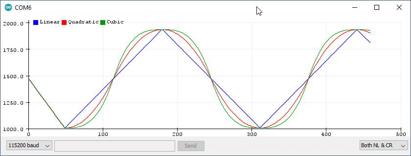
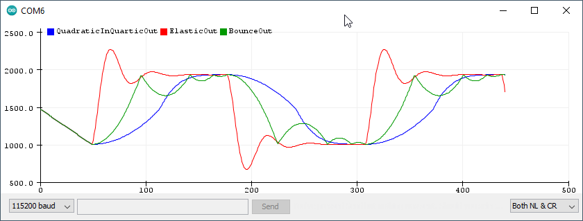

# [ServoEasing](https://github.com/ArminJo/ServoEasing) - move your servo more natural
Available as Arduino library "ServoEasing"

### [Version 2.3.2](https://github.com/ArminJo/ServoEasing/releases)

YouTube video of ServoEasing in action

## Servo easing library for Arduino
This is a library for smooth servo movements. It uses the standard Arduino Servo library and therefore has its restrictions regarding pins and platform support. 
As an alternative to the Arduino Servo library, ServoEasing can be used with a [PCA9685 servo expander](https://learn.adafruit.com/16-channel-pwm-servo-driver?view=all) using the Arduino Wire library or a compatible one (and their restrictions). 
For **ESP32** you need to install the Arduino ESP32Servo library.  
For **AVR**, if you need only one or two servos, you may want to use the included [Lightweight Servo library](https://github.com/ArminJo/LightweightServo) instead of the Arduino Servo library because it uses only the internal Timer1 with no software overhead and has no problems with interrupt blocking libraries like SoftwareSerial, Adafruit_NeoPixel and DmxSimple. 
For instructions how to enable these alternatives see [Modifying library properties](#modifying-library-properties)

### Features
- **Linear** and 9 other ease movements are provided.
- All servos can move **synchronized** or **independently**.
- **Non blocking** movements are enabled by using **startEaseTo\* functions** by reusing the interrupts of the servo timer Timer1 or using a dedicated timer on other platforms. This function is not available for all platforms.
- Trim value for each servo may be set.
- Reverse operation of servo is possible eg. if it is mounted head down.
- Allow to specify an arbitrary mapping between degrees and microseconds by `attach(int aPin, int aMicrosecondsForServoLowDegree, int aMicrosecondsForServoHighDegree, int aServoLowDegree, int aServoHighDegree)`

## Usage
Just call **myServo.startEaseTo()** instead of **myServo.write()** and you are done. Or if you want to wait (blocking) until servo has arrived, use **myServo.easeTo()**. 
- Do not forget to **initially set the start position** for the Servo by simply calling **myServo.write()**, since the library has **no knowledge about your servos initial position** and therefore starts at **0 degree** at the first move, which may be undesirable. 
- And do not forget to **initially set the moving speed** (as degrees per second) with **myServo.setSpeed()** or as **second parameter** to startEaseTo() or easeTo(). Otherwise the Servo will start with the speed of 5 degrees per second, to indicate that speed was not set. 

### Includes the following **easing functions**:
- Linear
- Quadratic
- Cubic
- Quartic
- Sine (similar to Quadratic)
- Circular
- Back
- Elastic
- Bounce
- User defined

### All easing functions can be used in the following **variants**:
- In
- Out
- InOut
- Bouncing (mirrored Out) e.g. Bouncing of the Sine function results in the upper (positive) half of the sine.

### Comparison between Quadratic, Cubic and Sine easings.
**Arduino Serial Plotter** result of a modified SymmetricEasing example with `#define PRINT_FOR_SERIAL_PLOTTER` in the library file *ServoEasing.h* enabled.

## Useful resources
- [Easings Cheat Sheet](https://easings.net/)
- [Robert Penner](http://www.robertpenner.com/easing/)
- [C functions on Github](https://github.com/warrenm/AHEasing/blob/master/AHEasing/easing.c)
- [Interactive cubic-bezier](http://cubic-bezier.com)

# Resolution of servo positioning
- The standard range of 544 to 2400 us per 180 degree results in an timing of around **10 us per degree**.
- The **Arduino Servo library on AVR** uses an prescaler of 8 at 16 MHz clock resulting in a resolution of **0.5 us**.
- The **PCA9685 expander** has a resolution of **4.88 us** per step (@ 20 ms interval) resulting in a resolution of **0.5 degree**.
Digital Servos have a **deadband of approximately 5 us / 0.5 degree** which means, that you will see a **stuttering movement** if the moving speed is slow.
If you control them with a PCA9685 expander it may get worse, since one step of 4.88 us can be within the deadband, so it takes 2 steps to move the servo from its current position.

# Modifying library properties
To access the Arduino library files from a sketch, you have to first use *Sketch/Show Sketch Folder (Ctrl+K)* in the Arduino IDE. 
Then navigate to the parallel `libraries` folder and select the library you want to access. 
The library files itself are located in the `src` sub-directory. 
If you did not yet store the example as your own sketch, then with *Ctrl+K* you are instantly in the right library folder.

## Consider to use [Sloeber](http://eclipse.baeyens.it/stable.php?OS=Windows) as IDE
If you are using Sloeber as your IDE, you can easily define global symbols at *Properties/Arduino/CompileOptions*. 

## Using PCA9685 16-Channel Servo Expander
To enable the use of the expander, open the library file *ServoEasing.h* and comment out the line `#define USE_PCA9685_SERVO_EXPANDER` or define global symbol with `-DUSE_PCA9685_SERVO_EXPANDER` which is not yet possible in Arduino IDE:-(. 
In expander mode, timer1 is only required for the startEaseTo* functions.

Be aware that the PCA9685 expander is **reset** at the first `attach()` and **initialized** at every further `attach()`. 
To control simultaneously servos with the Arduino Servo library i.e. servos which are directly connected to the Arduino board, comment out the line `#define USE_SERVO_LIB` in the library file *ServoEasing.h*. 
In this case you should attach the expander servos first in order to initialize the expander board correctly.
And as long as no servo using the Arduino Servo library is attached,
the expander servos will not move, which should not be a problem since you normally attach all servos in `setup()`. 
Resolution of the is PCA9685 signal is approximately 0.5 degree.

On the **ESP32 the I2C library is only capable to run at 100 kHz**, because it interferes with the Ticker / Timer library used.
Even with 100 kHz clock we have some dropouts / NAK's because of sending address again instead of first data. 
Since the raw transmission time of 32 Servo positions is 17.4 us @ 100 kHz, not more than 2 expander boards can be connected to one I2C bus on an ESP32 board, if all servos should move simultaneously.

## Using the included [Lightweight Servo library](https://github.com/ArminJo/LightweightServo) for AVR
Using the **Lightweight Servo Library** reduces sketch size and makes the servo pulse generating immune to other libraries blocking interrupts for a longer time like SoftwareSerial, Adafruit_NeoPixel and DmxSimple. 
Up to 2 servos are supported by this library and they must be attached to pin 9 and/or 10 of the Arduino board. 
To enable it, open the library file *ServoEasing.h* and comment out the line `#define USE_LEIGHTWEIGHT_SERVO_LIB` or define global symbol with `-DUSE_LEIGHTWEIGHT_SERVO_LIB` which is not yet possible in Arduino IDE:-(. 
If not using the Arduino IDE, take care that Arduino Servo library sources are not compiled / included in the project.

## Reducing library size
If you have only one or two servos, then you can save program space by using Lightweight Servo library.
This saves 742 bytes FLASH and 42 bytes RAM. 
If you do not require the more complex easing functions like `Sine` etc., which in turn use the sin(), cos(), sqrt() and pow() functions, you can shrink library size by approximately 1850 bytes by commenting out the line `#define KEEP_SERVO_EASING_LIBRARY_SMALL` in the library file *ServoEasing.h* or define global symbol with `-DKEEP_SERVO_EASING_LIBRARY_SMALL` which is not yet possible in Arduino IDE:-(. 

# [Examples](tree/master/examples)
All examples with up to 2 Servos can be used without modifications with the [Lightweight Servo library](https://github.com/ArminJo/LightweightServo) for AVR by by commenting out the line `#define USE_LEIGHTWEIGHT_SERVO_LIB` in the library file *ServoEasing.h* (see above).

## Simple example
This example does not use interrupts and should therefore run on any platform where the Arduino Servo library is available.  
**Arduino Serial Plotter** result of this example if `#define PRINT_FOR_SERIAL_PLOTTER` in the library file *ServoEasing.h* is enabled. 

## OneServo example
This example moves one Servo with different speeds and using blocking and interrupt commands. The internal LED blinks when using interrupt based commands.

## TwoServo and ThreeServo examples
This example shows how to move 2 or 3 servos synchronized or independently.

## SymmetricEasing example
This example shows symmetric (end movement is mirror of start movement) linear, quadratic and cubic movements for 3 servos synchronously.
**Arduino Serial Plotter** result of this example if `#define PRINT_FOR_SERIAL_PLOTTER` in the library file *ServoEasing.h* is enabled. 

## AsymmetricEasing example
This example shows asymmetric (end movement is different from start movement) non linear movements for 3 servos synchronously.
It includes a partially **user defined easing function**  `EaseQuadraticInQuarticOut()`.
**Arduino Serial Plotter** result of this example if `#define PRINT_FOR_SERIAL_PLOTTER` in the library file *ServoEasing.h* is enabled. 

## ContinuousRotatingServo example
Example for using the servoEasing library to create speed ramps for a continuous rotating servo. This example rely on your servos stop value being **exacly 1500 microseconds**. If the stop value of your servo is NOT exactly 1500 microseconds, you must modify the `MICROSECONDS_FOR_ROTATING_SERVO_STOP` value in the library file *ServoEasing.h*.

## LightweightServoExample example
This example moves 2 servos attached at pin 9 and 10 using the LightweightServo library for ATmega328*.

## CatMover example
Demo of using two servos in a pan tilt housing to move a laser pointer.

## QuadrupedControl example
Control 8 servos to move a Quadruped robot. 
The full example with IR remote control, NeoPixel and US distance sensor support is available [here](https://github.com/ArminJo/QuadrupedControl).
Only for AVR, because it uses EEPROM.

### YouTube Video

## RobotArmControl example
Program for controlling a [robot arm with 4 servos](https://www.instructables.com/id/4-DOF-Mechanical-Arm-Robot-Controlled-by-Arduino) using 4 potentiometers and/or an IR Remote.
Only for AVR, because it uses EEPROM.

## PCA9685_Expander example
The OneServo example modified for using a PCA9685 expander board and the standard Arduino Wire library. 
You must comment out the line `#define USE_PCA9685_SERVO_EXPANDER` in *ServoEasing.h* to make the expander example work.

## PCA9685_ExpanderAndServo example
Combination of OneServo example and PCA9685_Expander example. Move one servo attached to the Arduino board and one servo attached to the PCA9685 expander board **simultaneously**.

## PCA9685_ExpanderFor32Servos example
Program to show the usage of 2 PCA9685 expander boards with 32 servos.
On the ESP32, the I2C library interferes with the 29 millisecond timer and therefore can only run at 100000 Hz or lower. 
You must comment out the line `#define USE_PCA9685_SERVO_EXPANDER` in *ServoEasing.h* to make the expander example work.

### YouTube Video

# Servo utilities

## EndPositionsTest example
This example helps you determine the right end values for your servo. 
These values are required for the `attach()` function, if your servo does not comply to the standard values.
E.g. some of my SG90 servos have a 0 degree period of 620 us instead of the standard 544. 
This example does not use the ServoEasing functions.

## SpeedTest example
This example gives you a feeling how fast your servo can move, what the end position values are and which refresh rate they accept. 
This example does not use the ServoEasing functions.
Not for ESP8266 because it requires 2 analog inputs.

# Internals
The API accepts only degree (except for write() and writeMicrosecondsOrUnits()) but internally only microseconds (or units (= 4.88 us) if using PCA9685 expander) and not degree are used to speed up things. Other expander or servo libraries can therefore easily be used. 

# Supported platforms
**Every Arduino platform with a Servo library** will work without any modifications in blocking mode. 
Non blocking behavior can always be achieved manually by calling `update()` in a loop - see last movement in [Simple example](examples/Simple/Simple.ino). 
Interrupt based movement (movement without calling `update()` manually in a loop) is supported for the following Arduino architectures: 
**avr, megaavr, sam, samd, esp8266, esp32, stm32, STM32F1 and apollo3.**

## Timer usage for interrupt based movement
On **AVR** Timer1 is used for the Arduino Servo library. To have non blocking easing functions its unused **Channel B** is used to generate an interrupt 100 us before the end of the 20 ms Arduino Servo refresh period. This interrupt then updates all servo values for the next refresh period.
| Platform | Timer | Library providing the timer |
|---|---|---|
| avr | Timer1 | Servo.h |
| ATmega | Timer5 | Servo.h |
| megaavr | TCA0 |  |
| sam | ID_TC8 (TC2 channel 2) |  |
| samd | TC5 |  |
| esp8266 + esp32 | Ticker | Ticker.h |
| stm32 | TIM3 | HardwareTimer.h |
| STM32F1 | 3 or 7 | HardwareTimer.h |
| Teensy |  | IntervalTimer |
| apollo3 | timer 3 segment A |  |

## Adding a new platform / board
If timer support is available for a platform the library can be ported by adding code for the Timer20ms like is was done for ESP and STM. 
To add a new platform, the following steps have to be performed:
1. If the new platform has an **Arduino compatible Servo library**, fine, otherwise include the one required for this platform like it is done for ESP32 [here](src/ServoEasing.h#L92).
2. You need a **20ms interrupt source** providing the functions enableServoEasingInterrupt() and (optional) disableServoEasingInterrupt(). Extend these functions with code for the new platform. Place includes and timer definitions at top of *ServoEasing.cpp*.
3. If your interrupt source requires an ISR (Interrupt Service Routine) place it after disableServoEasingInterrupt() where all the other ISR are located.
4. To test the new platform, you may want to enable **TRACE output** by commenting out the line `#define TRACE` in *ServoEasing.cpp*
and enabling **interrupt timing feedback** by commenting out the line `#define MEASURE_SERVO_EASING_INTERRUPT_TIMING` in *ServoEasing.h*.
5. If it works for you, please issue a Pull Request, to share your efforts with the community.

Good luck!

# Troubleshooting
If you see strange behavior, you can open the library file *ServoEasing.h* and comment out the line `#define TRACE` or `#define DEBUG`.
This will print internal information visible in the Arduino *Serial Monitor* which may help finding the reason for it.

# Revision History
### Version 2.3.2
- Removed blocking wait for ATmega32U4 Serial in examples.
- Improved output for Arduino Serial Plotter.

### Version 2.3.1
- Fixed wrong timer selection for `STM32F1xx` / `ARDUINO_ARCH_STM32`.
- Documentation.

### Version 2.3.0
- Fixed EASE_LINEAR formula bug introduced with 2.0.0 for 32 bit CPU's. Thanks to [drifkind](https://github.com/drifkind).
- Added `stop()`, `continueWithInterrupts()` and `continueWithoutInterrupts()` functions.

### Version 2.2.0
- ATmega4809 (Uno WiFi Rev 2, Nano Every) support.
- Corrected position of macro for MAX_EASING_SERVOS.

### Version 2.1.1
- Fixed bug in detach of first servo.

### Version 2.1.0
- Added support of **Teensy** boards.

### Version 2.0.0
- `PCA9685_Expander` and standard Servos can be controlled simultaneously by defining `USE_SERVO_LIB`.
- Changed some types to _fast types
- Standardize pins for all examples

### Version 1.6.1
- Fix bug for **Arduino SAMD** boards.

### Version 1.6.0
- Added support of **Apollo3** boards.
- Print library version in examples.

### Version 1.5.2
- More examples using `areInterruptsActive()`.
- Added support of **Arduino SAMD** boards.

### Version 1.5.1
- Added support for **STM32** cores of Arduino Board manager. Seen in the Arduino IDE as "Generic STM32F1 series" from STM32 Boards.
- Inserted missing `Wire.begin()` in setup of `PCA9685_Expander` example.
- In `isMovingAndCallYield()` yield() only called/required for an ESP8266.
- New function `areInterruptsActive()`, especially for ESP32.

### Version 1.5.0
- Use type `Print *` instead of `Stream *`.
- New LightweightServoExample.
- Added function `delayAndUpdateAndWaitForAllServosToStop()`.
- Added **Arduino Due** support by using timer 8.
- New PCA9685_ExpanderFor32Servos example.

### Version 1.4.3
- Improved detach() handling.
- Initialize variables explicitly to 0 in constructor. On an ESP8266 they were NOT initialized to 0 :-(.

### Version 1.4.2
- Improved INVALID_SERVO handling.
- Speed 0 (not initialized) handling.
- Fixed bug in ThreeServos example.

### Version 1.4.1
- Improved documentation and definitions for continuous rotating servo. Thanks to Eebel!
- Improved support and documentation for generating Arduino Serial Plotter output.
- Support of **STM32F1 / BluePill** boards.

### Version 1.4.0
- setTrim has additional parameter `doWrite` which is default `false` in contrast to older versions, where a write was always performed.
- New `attach( aPin,  aMicrosecondsForServoLowDegree,  aMicrosecondsForServoHighDegree,  aServoLowDegree,  aServoHighDegree)` function for arbitrary mapping of servo degree to servo pulse width.
- Order of Servos in `sServoArray[]` now depends from order of calling `attach()` and not from order of declaration.
- New example for continuous rotating servo.

### Version 1.3.1
- Added `detach()` function.

### Version 1.3.0
- Added **ESP32** support by using *ESP32Servo.h* and *Ticker.h* instead of *Servo.h* timer interrupts.
- Changed degree parameter and values from uint8_t to integer to support operating a servo from -90 to + 90 degree with 90 degree trim.
- `RobotArmControl` + `QuadrupedControl` examples refactored.
- Changed "while" to "for" loops to avoid a gcc 7.3.0 atmel6.3.1 bug.
- Extended `SpeedTest` example. Now also able to change the width of the refresh period.

### Version 1.2
- Added **ESP8266** support by using Ticker instead of timer interrupts for ESP.
- `AsymetricEasing` example overhauled.

### Version 1.1.0
- Corrected sine, circular, back and elastic IN functions.
- `easeTo()` and `write()` store their degree parameter now also in `sServoNextPositionArray`.
- added `setSpeed()`, `getSpeed()`, `setSpeedForAllServos()` and added `ease*` functions without speed parameter.
- added `getEndMicrosecondsOrUnits()`, `getDeltaMicrosecondsOrUnits()`.
- added setDegreeForAllServos(uint8_t aNumberOfValues, va_list * aDegreeValues),setDegreeForAllServos(uint8_t aNumberOfValues, ...).
- added compile switch `PROVIDE_ONLY_LINEAR_MOVEMENT` to save additional 1500 bytes FLASH if enabled.
- added convenience function `clipDegreeSpecial()`.

### Version 1.0.0
Initial Arduino library version

# CI
Since Travis CI is unreliable and slow (5 times slower 17:43 vs. 3:15 minutes), the library examples are now tested with GitHub Actions for [this  boards](.github/workflows/LibraryBuild.yml#L41).

## Requests for modifications / extensions
Please write me a PM including your motivation/problem if you need a modification or an extension.

#### If you find this library useful, please give it a star.
