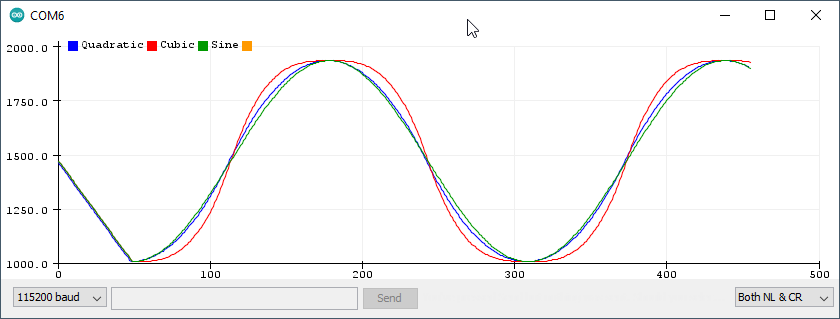

# [ServoEasing](https://github.com/ArminJo/ServoEasing) - move your servo more natural
A library for smooth servo movements. It uses the standard Arduino Servo library and therefore has its restrictions regarding pins and platform support.

### [Version 2.4.2](https://github.com/ArminJo/ServoEasing/archive/master.zip) - work in progress

[](https://www.gnu.org/licenses/gpl-3.0)
[](https://www.ardu-badge.com/ServoEasing)
[](https://github.com/ArminJo/ServoEasing/commits/master)
[](https://github.com/ArminJo/ServoEasing/actions)


Available as [Arduino library "ServoEasing"](https://www.arduinolibraries.info/libraries/servo-easing).

#### YouTube video of ServoEasing in action

[](https://www.youtube.com/watch?v=fC9uxdOBhfA)

# Table of content
- [Servo easing library for Arduino](https://github.com/ArminJo/ServoEasing#servo-easing-library-for-arduino)
- [Features](https://github.com/ArminJo/ServoEasing#features)
- [List of easing functions](https://github.com/ArminJo/ServoEasing#list-of-easing-functions)
- [API](https://github.com/ArminJo/ServoEasing#api)
- [Usage](https://github.com/ArminJo/ServoEasing#usage)
- [Comparison between Quadratic, Cubic and Sine easings.](https://github.com/ArminJo/ServoEasing#comparison-between-quadratic-cubic-and-sine-easings)
- [Useful resources](https://github.com/ArminJo/ServoEasing#useful-resources)
- [Resolution of servo positioning](https://github.com/ArminJo/ServoEasing#resolution-of-servo-positioning)
- [Speed of servo positioning](https://github.com/ArminJo/ServoEasing#speed-of-servo-positioning)
- [Using the new *.hpp files / how to avoid `multiple definitions` linker errors](https://github.com/ArminJo/ServoEasing#using-the-new-hpp-files--how-to-avoid-multiple-definitions-linker-errors)
- [Compile options / macros for this library](https://github.com/ArminJo/ServoEasing#compile-options--macros-for-this-library)
- [Using PCA9685 16-Channel Servo Expander](https://github.com/ArminJo/ServoEasing#using-pca9685-16-channel-servo-expander)
- [Using the included Lightweight Servo library for AVR](https://github.com/ArminJo/ServoEasing#using-the-included-lightweight-servo-library-for-avr)
- [Examples](https://github.com/ArminJo/ServoEasing/blob/master/examples#servoeasing-examples)
- [Servo utilities](https://github.com/ArminJo/ServoEasing/tree/master/examples#servo-utilities)
- [Building breadboard servo adapter](https://github.com/ArminJo/ServoEasing#building-breadboard-servo-adapter)
- [Internals](https://github.com/ArminJo/ServoEasing#internals)
- [Supported Arduino architectures](https://github.com/ArminJo/ServoEasing#supported-arduino-architectures)
- [Timer usage for interrupt based movement](https://github.com/ArminJo/ServoEasing#timer-usage-for-interrupt-based-movement)
- [Adding a new platform / board](https://github.com/ArminJo/ServoEasing#adding-a-new-platform--board)
- [Troubleshooting](https://github.com/ArminJo/ServoEasing#troubleshooting)
- [Revision History](https://github.com/ArminJo/ServoEasing#revision-history)
- [CI](https://github.com/ArminJo/ServoEasing#ci)
- [Requests for modifications / extensions](https://github.com/ArminJo/ServoEasing#requests-for-modifications--extensions)

# Servo easing library for Arduino
Its purpose is to interpolate the movement between two servo positions set by software.<br/>
If your servo control data is e.g. generated by an joystick or other *"slow"* changing inputs and therefore does not change suddenly or does not jump, **you most likely do not need this library!**, you may consider to use a **digital low pass** or **[simple EMA filters](https://github.com/ArminJo/Arduino-Utils#simpleemafilterscpp)** to smooth your values used to control the servos.<br/>
ServoEasing works with the Arduino Servo library as well as with [PCA9685 servo expanders](https://learn.adafruit.com/16-channel-pwm-servo-driver?view=all).
The expander in turn requires the Arduino Wire library or a [compatible one](https://github.com/felias-fogg/SoftI2CMaster) and is bound to their restrictions.<br/>
For **ESP32** you need to install the Arduino ESP32Servo library.<br/>
<br/>
If you require only one or two servos, you may want to use the included [LightweightServo library](https://github.com/ArminJo/LightweightServo) (only for **AVR**), instead of the Arduino Servo library.
The LightweightServo library uses the internal Timer1 with no software overhead and therefore has no problems with **servo jitterring** or interrupt blocking libraries like SoftwareSerial, Adafruit_NeoPixel and DmxSimple.<br/>
For instructions how to enable these alternatives, see [Compile options / macros](https://github.com/ArminJo/ServoEasing#compile-options--macros-for-this-library).

# Features
- **Linear** and 9 other ease movements are provided.
- All servos can move **synchronized** or **independently**.
- **Non blocking** movements are enabled by using **startEaseTo\* functions** by reusing the interrupts of the servo timer Timer1 or using a dedicated timer on other platforms. This function is not available for all platforms.
- A **trim** value (added to the degree/units/microseconds value requested) for each servo may be set.
- **Reverse operation** of servo is possible eg. if it is mounted head down.
- Allow to specify an arbitrary mapping between degrees and microseconds by `attach(int aPin, int aMicrosecondsForServoLowDegree, int aMicrosecondsForServoHighDegree, int aServoLowDegree, int aServoHighDegree)`.
- **Servo speed** can be specified in **degree per second** or **milliseconds** for the complete move.
- Degree values >= 400 can optionally be taken as microsecond values for the servo pulse.
- All ServoEasing objects are accessible by using the [`ServoEasing::ServoEasingArray[]`](https://github.com/ArminJo/ServoEasing/blob/master/examples/ThreeServos/ThreeServos.ino#L104).

# List of easing functions:
- Linear
- Quadratic
- Cubic
- Quartic
- Sine (similar to Quadratic)
- Circular
- Back
- Elastic
- Bounce
- User defined

### All easing functions can be used in the following variants:
- In
- Out
- InOut
- Bouncing (mirrored Out) e.g. Bouncing of the Sine function results in the upper (positive) half of the sine.

# [API](https://github.com/ArminJo/ServoEasing/blob/master/src/ServoEasing.h#L328)

# Usage
See also [the examples here](https://github.com/ArminJo/ServoEasing/blob/master/examples#servoeasing-examples).<br/>

```c++
void setup() {
    Servo1.attach(SERVO1_PIN, 45);
}
void loop() {
    Servo1.easeTo(135, 40);
    Servo1.easeTo(45, 40);
}
```

Just call `myServo.startEaseTo()` instead of `myServo.write()` and you are done. Or if you want to wait (blocking) until servo has arrived, use `myServo.easeTo()`.<br/>
- Do not forget to **initially set the start position** for the Servo, since the library has **no knowledge about your servos initial position** and therefore starts at **0 degree** at the first move, which may be undesirable.<br/>
  Setting the start position of the servo can be done as the second parameter to `myServo.attach(int aPin, int aInitialDegree)` or by calling `myServo.write(int aDegree)`,
- And do not forget to **initially set the moving speed** (as degrees per second) with `myServo.setSpeed()` or as **second parameter** to startEaseTo() or easeTo(). Otherwise the Servo will start with the speed of 5 degrees per second, to indicate that speed was not set.<br/>

# Comparison between Quadratic, Cubic and Sine easings.
**Arduino Serial Plotter** result of the SymmetricEasing example.


# Useful resources
- [Easings Cheat Sheet](https://easings.net/)
- [Robert Penner](http://www.robertpenner.com/easing/)
- [C functions on Github](https://github.com/warrenm/AHEasing/blob/master/AHEasing/easing.c)
- [Interactive cubic-bezier](http://cubic-bezier.com)

# Resolution of servo positioning
- The standard range of 544 to 2400 탎 per 180 degree results in an timing of around **10 탎 per degree**.
- The **Arduino Servo library on AVR** uses an prescaler of 8 at 16 MHz clock resulting in a resolution of **0.5 탎**.
- The **PCA9685 expander** has a resolution of **4.88 탎** per step (@ 20 ms interval) resulting in a resolution of **0.5 degree**.
Digital Servos have a **deadband of approximately 5 탎 / 0.5 degree** which means, that you will see a **stuttering movement** if the moving speed is slow.
If you control them with a PCA9685 expander it may get worse, since one step of 4.88 탎 can be within the deadband, so it takes 2 steps to move the servo from its current position.

# Speed of servo positioning
These values are measured with the [SpeedTest example](https://github.com/ArminJo/ServoEasing/blob/master/examples/SpeedTest/SpeedTest.ino).

These are the fastest values for my SG90 servos at 5 volt (4.2 volt with servo active).
| Degree | Duration | Speed |
|-|-|-|
| 180 | 400 ms | 450 degree per second |
| 90 | 300 ms  | 300 degree per second |
| 45 | 180 ms  | 250 degree per second |
| 30 | 150 ms  | 200 degree per second |
| 20 | 130 ms  | 150 degree per second |
| 10 | 80 ms   | 125 degree per second |

Values for the MG90Sservos servos at 5 volt (4.2 volt with servo active).
| Degree | Duration | Speed |
|-|-|-|
| 180 | 330 ms | 540 degree per second |
| 90 | 220 ms  | 410 degree per second |
| 45 | 115 ms  | 390 degree per second |

# Using the new *.hpp files / how to avoid `multiple definitions` linker errors
In order to support [compile options](#compile-options--macros-for-this-library) more easily, the line `#include <ServoEasing.h>`
must be changed to `#include <ServoEasing.hpp>`, but only in your **main program (aka *.ino file with setup() and loop())**, like it is done in the examples.<br/>
In **all other files** you must use `#include <ServoEasing.h>`, otherwise you will get tons of **"multiple definition"** errors.
Take care that all macros you define in your main program before `#include <ServoEasing.hpp>`,
e.g. `MAX_EASING_SERVOS`, `REFRESH_INTERVAL` and `USE_PCA9685_SERVO_EXPANDER` should also be specified before the *ServoEasing.h* include,
otherwise they are set to default values in *ServoEasing.h* or the include may otherwise not work as expected!

# Compile options / macros for this library
To customize the library to different requirements, there are some compile options / macros available.<br/>
These macros must be defined in your program before the line `#include <ServoEasing.hpp>` to take effect.<br/>
Modify them by enabling / disabling them, or change the values if applicable.

| Name | Default value | Description |
|-|-|-|
| `USE_PCA9685_SERVO_EXPANDER` | disabled | Enables the use of the PCA9685 I2C expander chip/board. |
| `USE_SERVO_LIB` | disabled | Use of PCA9685 normally disables use of regular servo library. You can force additional using of regular servo library by defining `USE_SERVO_LIB`. See [below](https://github.com/ArminJo/ServoEasing#using-pca9685-16-channel-servo-expander). |
| `PROVIDE_ONLY_LINEAR_MOVEMENT` | disabled | Disables all but LINEAR movement. Saves up to 1540 bytes program memory. |
| `DISABLE_COMPLEX_FUNCTIONS` | disabled | Disables the SINE, CIRCULAR, BACK, ELASTIC and BOUNCE easings. Saves up to 1850 bytes program memory. |
| `MAX_EASING_SERVOS` | 12, 16(for PCA9685) | Saves 4 byte RAM per servo. If this value is smaller than the amount of servos declared, attach() will return error and other library functions will not work as expected.<br/>Of course all *AllServos*() functions and isOneServoMoving() can't work correctly! |
| `ENABLE_MICROS_AS_DEGREE_PARAMETER` | disabled | Enables passing also microsecond values as (target angle) parameter (see [OneServo example](https://github.com/ArminJo/ServoEasing/blob/master/examples/OneServo/OneServo.ino#L93)). Requires additional 128 bytes program memory. |
| `PRINT_FOR_SERIAL_PLOTTER` | disabled | Generate serial output for Arduino Plotter (Ctrl-Shift-L). |
| `DEBUG` | disabled | Generates lots of lovely debug output for this library. |
| `USE_LEIGHTWEIGHT_SERVO_LIB` | disabled | Makes the servo pulse generating immune to other libraries blocking interrupts for a longer time like SoftwareSerial, Adafruit_NeoPixel and DmxSimple. See below. Saves up to 742 bytes program memory and 42 bytes RAM. |

### Changing include (*.h) files with Arduino IDE
First, use *Sketch > Show Sketch Folder (Ctrl+K)*.<br/>
If you have not yet saved the example as your own sketch, then you are instantly in the right library folder.<br/>
Otherwise you have to navigate to the parallel `libraries` folder and select the library you want to access.<br/>
In both cases the library source and include files are located in the libraries `src` directory.<br/>
The modification must be renewed for each new library version!

### Modifying compile options / macros with PlatformIO
If you are using PlatformIO, you can define the macros in the *[platformio.ini](https://docs.platformio.org/en/latest/projectconf/section_env_build.html)* file with `build_flags = -D MACRO_NAME` or `build_flags = -D MACRO_NAME=macroValue`.

### Modifying compile options / macros with Sloeber IDE
If you are using [Sloeber](https://eclipse.baeyens.it) as your IDE, you can easily define global symbols with *Properties > Arduino > CompileOptions*.<br/>


# Using PCA9685 16-Channel Servo Expander
To enable the use of the expander, open the library file *ServoEasing.h* and activate the line `#define USE_PCA9685_SERVO_EXPANDER`.<br/>
In expander mode, timer1 is only required for the startEaseTo* functions.

Be aware that the PCA9685 expander is **reset** at the first `attach()` and **initialized** at every further `attach()`.<br/>
To control simultaneously servos with the Arduino Servo library i.e. servos which are directly connected to the Arduino board, activate the line `#define USE_SERVO_LIB` in the library file *ServoEasing.h*.<br/>
In this case you should attach the expander servos first in order to initialize the expander board correctly.
And as long as no servo using the Arduino Servo library is attached, the expander servos will not move,
which should not be a problem since you normally attach all servos in `setup()`.<br/>
**Resolution** of the is PCA9685 signal is approximately **0.5 degree**.

On the **ESP32 the I2C library is only capable to run at 100 kHz**, because it interferes with the Ticker / Timer library used.
Even with 100 kHz clock we have some dropouts / NAK's because of sending address again instead of first data.<br/>
Since the raw transmission time of 32 Servo positions is 17.4 탎 @ 100 kHz, not more than 2 expander boards can be connected to one I2C bus on an ESP32 board, if all servos should move simultaneously.<br/>
If you do not use any timer in your program you can increase speed up to 800 kHz. Maybe you have to attach 2x2k2 Ohm pullup resistors to the I2C lines to have it working reliably.

# Using the included [Lightweight Servo library](https://github.com/ArminJo/LightweightServo) for AVR
Using the **Lightweight Servo Library** reduces sketch size and makes the servo pulse generating immune to other libraries blocking interrupts for a longer time like SoftwareSerial, Adafruit_NeoPixel and DmxSimple.<br/>
Up to 2 servos are supported by this library and they must be physically attached to pin 9 and/or 10 of the Arduino board.<br/>
To enable it, open the library file *ServoEasing.h* and activate the line `#define USE_LEIGHTWEIGHT_SERVO_LIB` or define global symbol with `-DUSE_LEIGHTWEIGHT_SERVO_LIB` which is not yet possible in Arduino IDE :disappointed:.<br/>
If not using the Arduino IDE, take care that Arduino Servo library sources are not compiled / included in the project.

# Examples
All examples are documented [here](https://github.com/ArminJo/ServoEasing/blob/master/examples#servoeasing-examples)<br/>
Examples with up to 2 Servos can be used without modifications with the [Lightweight Servo library](https://github.com/ArminJo/LightweightServo) for AVR by by commenting out the line `#define USE_LEIGHTWEIGHT_SERVO_LIB` in the library file *ServoEasing.h* (see above).

# [Servo utilities](https://github.com/ArminJo/ServoEasing/tree/master/examples#servo-utilities)

# Building breadboard servo adapter
Converting a 10 pin double row pin header with 21 mm pin length to a breadboard servo adapter.


# Internals
The API accepts only degree (except for write() and writeMicrosecondsOrUnits()) but internally only microseconds (or units (= 4.88 탎) if using PCA9685 expander) and not degree are used to speed up things. Other expander or servo libraries can therefore easily be used.<br/>

# Supported Arduino architectures
**Every Arduino architecture with a Servo library** will work without any modifications in blocking mode.<br/>
Non blocking behavior can always be achieved manually by calling `update()` in a loop - see last movement in [Simple example](examples/Simple/Simple.ino).<br/>
Interrupt based movement (movement without calling `update()` manually in a loop) is supported for the following Arduino architectures:<br/>
**avr, megaavr, sam, samd, esp8266, esp32, stm32, STM32F1 and apollo3.**

# Timer usage for interrupt based movement
On **AVR** Timer1 is used for the Arduino Servo library. To have non blocking easing functions its unused **Channel B** is used to generate an interrupt 100 탎 before the end of the 20 ms Arduino Servo refresh period. This interrupt then updates all servo values for the next refresh period.
| Platform | Timer | Library providing the timer |
|---|---|---|
| avr | Timer1 | Servo.h |
| ATmega | Timer5 | Servo.h |
| megaavr | TCA0 |  |
| sam | ID_TC8 (TC2 channel 2) |  |
| samd | TC5 |  |
| esp8266 + esp32 | Ticker | Ticker.h |
| stm32 | TIM3 | HardwareTimer.h |
| STM32F1 | 3 or 7 | HardwareTimer.h |
| Teensy |  | IntervalTimer |
| apollo3 | timer 3 segment A |  |
| Mbed | mbed::Ticker | Ticker.h |
| [RP2040 / Pi Pico](https://github.com/earlephilhower/arduino-pico | [default alarm pool](https://raspberrypi.github.io/pico-sdk-doxygen/group__repeating__timer.html) | time.h |

# Adding a new platform / board
If timer support is available for a platform the library can be ported by adding code for the Timer20ms like is was done for ESP and STM.<br/>
To add a new platform, the following steps have to be performed:
1. If the new platform has an **Arduino compatible Servo library**, fine, otherwise include the one required for this platform like it is done for ESP32 [here](src/ServoEasing.h#L83).
2. You need a **20ms interrupt source** providing the functions enableServoEasingInterrupt() and (optional) disableServoEasingInterrupt(). Extend these functions with code for the new platform. Place includes and timer definitions at top of *ServoEasing.hpp*.
3. If your interrupt source requires an ISR (Interrupt Service Routine) place it after disableServoEasingInterrupt() where all the other ISR are located.
4. To test the new platform, you may want to enable **TRACE output** by commenting out the line `#define TRACE` in *ServoEasing.hpp*
and enabling **interrupt timing feedback** by commenting out the line `#define MEASURE_SERVO_EASING_INTERRUPT_TIMING` in *ServoEasing.h*.
5. If it works for you, please issue a Pull Request, to share your efforts with the community.

Good luck!

# Troubleshooting
If you see strange behavior, you can open the library file *ServoEasing.h* and activate the line `#define TRACE` or `#define DEBUG`.
This will print internal information visible in the Arduino *Serial Monitor* which may help finding the reason for it.

# Revision History
### Version 2.4.1
- RP2040 support.

### Version 2.4.0
- New `attach()` functions with initial degree parameter to be written immediately. This replaces the `attach()` and `write()` combination at setup.
- Renamed `ServoEasing.cpp` to `ServoEasing.hpp` and `LightweightServo.cpp` to `LightweightServo.hpp`.

### Version 2.3.4
- `ENABLE_MICROS_AS_DEGREE_PARAMETER` also available for PCA9685 expander.
- Moved `sServoArrayMaxIndex`, `sServoNextPositionArray` and `sServoArray` to `ServoEasing::sServoArrayMaxIndex`, `ServoEasing::ServoEasingNextPositionArray` and `ServoEasing::ServoEasingArray`.
- Support for Apollo3 2.x core.
- Fixed ESP8266 pin definitions.

### Version 2.3.3
- Added compile option `ENABLE_MICROS_AS_DEGREE_PARAMETER` to allow usage of microseconds instead of degree as function arguments for all functions using degrees as argument.
- Improved LightweightServo API.

### Version 2.3.2
- Removed blocking wait for ATmega32U4 Serial in examples.
- Improved output for Arduino Serial Plotter.

### Version 2.3.1
- Fixed wrong timer selection for `STM32F1xx` / `ARDUINO_ARCH_STM32`.
- Documentation.

### Version 2.3.0
- Fixed EASE_LINEAR formula bug introduced with 2.0.0 for 32 bit CPU's. Thanks to [drifkind](https://github.com/drifkind).
- Added `stop()`, `continueWithInterrupts()` and `continueWithoutInterrupts()` functions.

### Version 2.2.0
- ATmega4809 (Uno WiFi Rev 2, Nano Every) support.
- Corrected position of macro for MAX_EASING_SERVOS.

### Version 2.1.1
- Fixed bug in detach of first servo.

### Version 2.1.0
- Added support of **Teensy** boards.

### Version 2.0.0
- `PCA9685_Expander` and standard Servos can be controlled simultaneously by defining `USE_SERVO_LIB`.
- Changed some types to _fast types
- Standardize pins for all examples

### Version 1.6.1
- Fix bug for **Arduino SAMD** boards.

### Version 1.6.0
- Added support of **Apollo3** boards.
- Print library version in examples.

### Version 1.5.2
- More examples using `areInterruptsActive()`.
- Added support of **Arduino SAMD** boards.

### Version 1.5.1
- Added support for **STM32** cores of Arduino Board manager. Seen in the Arduino IDE as "Generic STM32F1 series" from STM32 Boards.
- Inserted missing `Wire.begin()` in setup of `PCA9685_Expander` example.
- In `isMovingAndCallYield()` yield() only called/required for an ESP8266.
- New function `areInterruptsActive()`, especially for ESP32.

### Version 1.5.0
- Use type `Print *` instead of `Stream *`.
- New LightweightServoExample.
- Added function `delayAndUpdateAndWaitForAllServosToStop()`.
- Added **Arduino Due** support by using timer 8.
- New PCA9685_ExpanderFor32Servos example.

### Version 1.4.3
- Improved detach() handling.
- Initialize variables explicitly to 0 in constructor. On an ESP8266 they were NOT initialized to 0 :disappointed:.

### Version 1.4.2
- Improved INVALID_SERVO handling.
- Speed 0 (not initialized) handling.
- Fixed bug in ThreeServos example.

### Version 1.4.1
- Improved documentation and definitions for continuous rotating servo. Thanks to Eebel!
- Improved support and documentation for generating Arduino Serial Plotter output.
- Support of **STM32F1 / BluePill** boards.

### Version 1.4.0
- setTrim has additional parameter `doWrite` which is default `false` in contrast to older versions, where a write was always performed.
- New `attach( aPin,  aMicrosecondsForServoLowDegree,  aMicrosecondsForServoHighDegree,  aServoLowDegree,  aServoHighDegree)` function for arbitrary mapping of servo degree to servo pulse width.
- Order of Servos in `sServoArray[]` now depends from order of calling `attach()` and not from order of declaration.
- New example for continuous rotating servo.

### Version 1.3.1
- Added `detach()` function.

### Version 1.3.0
- Added **ESP32** support by using *ESP32Servo.h* and *Ticker.h* instead of *Servo.h* timer interrupts.
- Changed degree parameter and values from uint8_t to integer to support operating a servo from -90 to + 90 degree with 90 degree trim.
- `RobotArmControl` + `QuadrupedControl` examples refactored.
- Changed "while" to "for" loops to avoid a gcc 7.3.0 atmel6.3.1 bug.
- Extended `SpeedTest` example. Now also able to change the width of the refresh period.

### Version 1.2
- Added **ESP8266** support by using Ticker instead of timer interrupts for ESP.
- `AsymetricEasing` example overhauled.

### Version 1.1.0
- Corrected sine, circular, back and elastic IN functions.
- `easeTo()` and `write()` store their degree parameter now also in `sServoNextPositionArray`.
- added `setSpeed()`, `getSpeed()`, `setSpeedForAllServos()` and added `ease*` functions without speed parameter.
- added `getEndMicrosecondsOrUnits()`, `getDeltaMicrosecondsOrUnits()`.
- added setDegreeForAllServos(uint8_t aNumberOfValues, va_list * aDegreeValues),setDegreeForAllServos(uint8_t aNumberOfValues, ...).
- added compile switch `PROVIDE_ONLY_LINEAR_MOVEMENT` to save additional 1500 bytes program memory if enabled.
- added convenience function `clipDegreeSpecial()`.

### Version 1.0.0
Initial Arduino library version

# CI
Since Travis CI is unreliable and slow (5 times slower 17:43 vs. 3:15 minutes), the library examples are now tested with GitHub Actions for [this  boards](.github/workflows/LibraryBuild.yml#L41).


# Requests for modifications / extensions
Please write me a PM including your motivation/problem if you need a modification or an extension.

#### If you find this library useful, please give it a star.
